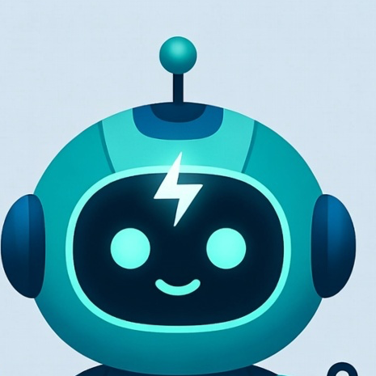
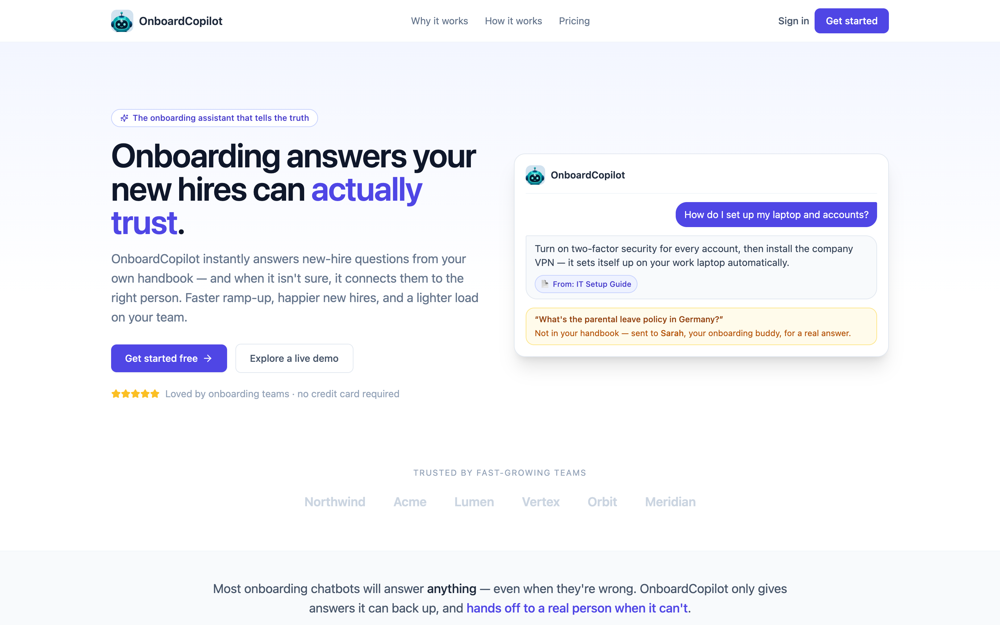
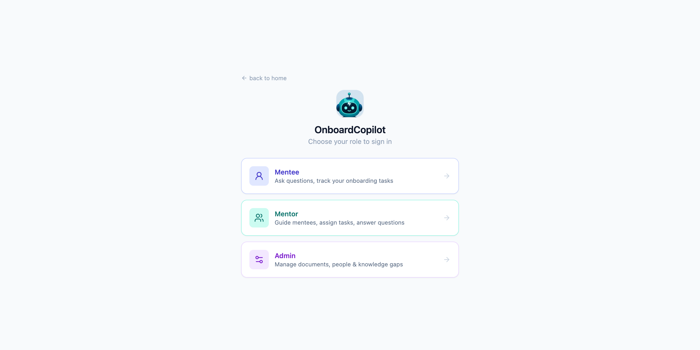
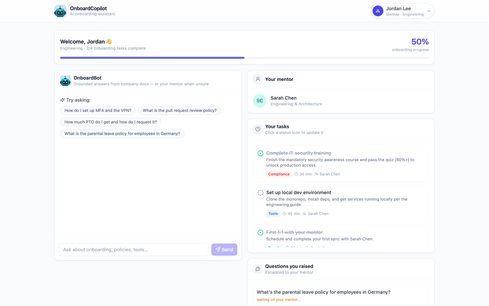
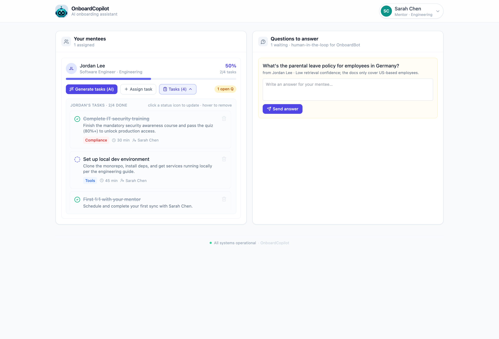
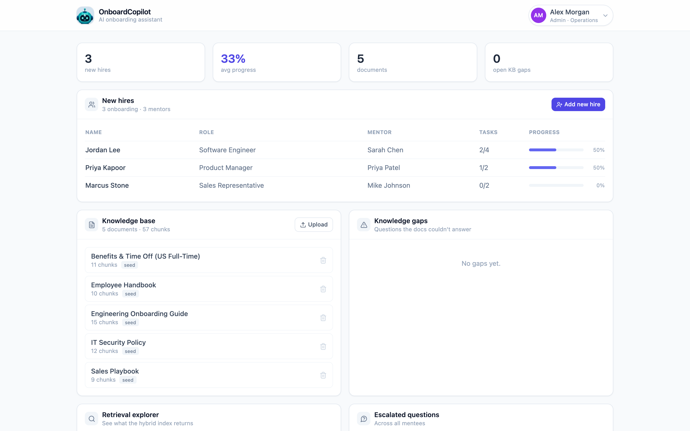

<div align="center">



# OnboardCopilot

**An AI onboarding copilot that answers new-hire questions from your company docs — with citations — and hands off to a human mentor when it isn't sure.**

[**🌐 Live demo →**](https://onboard-copilot.vercel.app)

`Python` · `FastAPI` · `LangChain` · `LangGraph` · `Gemini` · `Hybrid RAG` · `Vercel`



</div>

---

Three role-based logins (**admin / mentor / mentee**). New hires ask questions and
get answers from the company knowledge base with **citations**; mentors assign tasks
and — the part that matters — **answer the questions the AI couldn't**. When the docs
can't answer a mentee's question, OnboardBot **refuses to make something up**: it
escalates to that mentee's assigned mentor and logs a *knowledge gap*. The mentor's
answer flows back to the mentee. That's a real human-in-the-loop closing the RAG
escalation.

Built with Python, FastAPI, LangChain + LangGraph, and a real hybrid RAG pipeline.
Deploys to **Vercel** as a static React frontend plus a Python serverless function.
Runs end-to-end with **only a Gemini API key**.

> Inspired by [OnboardEase](https://github.com/Octaves0911/onboardease), rebuilt with
> the AI made real: that project's LangGraph agent isn't in the repo, its "documents"
> are three-sentence strings with no vector store, and its LLM calls run in the browser
> behind a hardcoded key. Here the retrieval is genuine, the graph is real, and the
> keys never touch the client.

---

## A look inside

**Three logins — one for each part of onboarding:**

<div align="center">

</div>

### 🧑‍💻 Mentee — ask, get cited answers, track tasks



OnboardBot answers from the handbook with sources; the new hire sees their onboarding
progress, their assigned tasks (click to advance status), who their mentor is, and the
status of any question the bot escalated on their behalf.

### 🧭 Mentor — assign & manage tasks, answer escalations



Mentors generate a grounded task plan with one click (or hand-assign tasks), manage
each task's status, and work the **inbox of questions OnboardBot couldn't answer** —
the human half of the loop.

### 🛠️ Admin — people, knowledge base, and the gaps



Every new hire's progress in one table, the indexed document corpus (with chunk
counts), and a **knowledge-gap tracker** that surfaces exactly what the handbook is
missing — the corpus telling you where it's blind.

---

## Why it's different

Most "chat with your company docs" demos answer *everything*, confidently, even when
they're wrong. OnboardCopilot is built around the opposite instinct:

- **Corrective RAG.** Retrieved chunks are *graded* by the model before they're used.
  Weak retrievals trigger a broadened re-search; genuinely unanswerable questions
  escalate instead of hallucinating.
- **Earned citations.** Every answer and every generated onboarding task links back to
  the exact document + section it came from — click to read the source.
- **A knowledge-gap tracker.** Questions the docs can't answer become a visible to-do
  list for admins: "here's what your handbook is missing." Nobody else demos the corpus
  telling you where it's blind.

---

## Architecture

```
                    React SPA (Vite, /frontend)  ──►  Vercel static CDN
                             │  fetch /api/*
                             ▼
          FastAPI  (api/index.py → api/_lib)   ──►  Vercel Python function
                             │
           ┌─────────────────┼───────────────────────────┐
           ▼                 ▼                             ▼
     Hybrid RAG        LangGraph agents              In-memory store
     (rag.py)          (agent.py)                    (store.py)
   BM25 + optional   OnboardBot: rewrite→retrieve   seeded from /seed/docs
   dense + RRF        →grade→(answer|retry|escalate) at cold start
                      PlanBuilder: retrieve→draft
```

### The OnboardBot graph (LangGraph)

```
START → rewrite → retrieve → grade ─┬─ confident ─────────→ answer → END
                      ▲              ├─ weak → transform ──┘ (retry once)
                      └──────────────┘
                                     └─ no evidence ──────→ escalate → END
```

`grade` is a conditional edge: it routes to **answer** when confidence clears the
threshold (`APP_CONFIDENCE_THRESHOLD`, default 0.6), to **transform** for one broadened
retry when results are weak, and to **escalate** when the docs simply don't cover it.
See [`api/_lib/agent.py`](api/_lib/agent.py).

### Retrieval ("proper RAG")

- Markdown is chunked by heading with a size cap + overlap.
- **BM25** (`rank_bm25`) gives a strong lexical signal with zero external services.
- **Dense embeddings** (Google, via the same Gemini key) add a semantic signal.
- The two are fused with **Reciprocal Rank Fusion**.
- Even with dense retrieval off, the LLM **relevance grader** provides the corrective
  step — so the app is never just "top-k cosine and hope."

See [`api/_lib/rag.py`](api/_lib/rag.py).

---

## Quickstart (local)

Two terminals. Backend first (the frontend proxies `/api` to it).

**1. Backend**
```bash
python3 -m venv .venv && source .venv/bin/activate   # Python 3.10+ required
pip install -r requirements.txt
export GEMINI_API_KEY=AIza...              # required (from aistudio.google.com/apikey)
uvicorn api.index:app --port 8000 --reload
```

> **Gemini free-tier quota is small.** The free tier allows only ~20 requests/day
> **per model**, and each chat runs 3–4 model calls (rewrite → grade → answer, plus a
> retry on low confidence). So on the free tier you get only a handful of questions per
> day before a `429 RESOURCE_EXHAUSTED` (quota resets daily). For a reliable demo,
> enable **pay-as-you-go billing** (Gemini flash is very cheap), or set `GEN_MODEL` and
> `FAST_MODEL` to two *different* models so they draw from separate daily quotas.

**2. Frontend**
```bash
cd frontend
npm install
npm run dev                                 # http://localhost:5173
```

Open http://localhost:5173 and log in.

### Demo logins (password `password123` for all)

| Role | Email | Sees |
|---|---|---|
| **Mentee** | `jordan@northwind.example` | OnboardBot chat, own assigned tasks (with status), mentor card, answers to their escalated questions |
| **Mentor** | `sarah@northwind.example` | Assigned mentees (with progress), AI/manual task assignment, and the **inbox of escalated questions to answer** |
| **Admin** | `admin@northwind.example` | All new hires + mentors, documents, knowledge gaps, retrieval explorer, all escalations |

Other seeded users: mentors `mike@` / `priya@`, mentees `marcus@` / `priyak@` (`@northwind.example`).

---

## Deploy to Vercel

The repo is a single Vercel project: the frontend builds to `frontend/dist` and the
Python API runs as a serverless function under `/api`.

1. Push this repo to GitHub and **Import** it in Vercel.
2. Leave the framework preset as **Other** — [`vercel.json`](vercel.json) already sets
   the build command, output directory, function timeout, and the `/api/*` rewrite.
3. Add environment variables (Project → Settings → Environment Variables):
   - `GEMINI_API_KEY` — **required** (or `GOOGLE_API_KEY`)
   - optionally `GEN_MODEL`, `FAST_MODEL`, `APP_CONFIDENCE_THRESHOLD`
   - dense Google embeddings are on by default via the same key; set
     `EMBEDDINGS_PROVIDER=none` to force BM25-only retrieval.
4. Deploy.

**Vercel constraints this design respects:** no persistent server (the API is a
stateless function), no persistent filesystem (the corpus is bundled and indexed
in-memory at cold start), no heavy ML deps (embeddings go through an HTTP API, so
`sentence-transformers`/`torch` never enter the bundle), and the 60s function timeout
(the graph is capped at a few Gemini calls; cheap steps use Flash-Lite).

---

## What's real vs. mocked

| Piece | Status |
|---|---|
| Hybrid retrieval (BM25 + RRF) | **Real**, runs on every query |
| Dense embeddings (Google) | **On by default** via the same Gemini key; falls back to BM25 if unavailable |
| LangGraph corrective-RAG graph | **Real** — rewrite / retrieve / grade / transform / answer / escalate |
| Citations | **Real** — parsed from the answer and mapped to source chunks |
| Plan builder grounding | **Real** — tasks cite retrieved chunks |
| Knowledge-gap logging + mentor human-in-the-loop | **Real** in-process; resets on serverless cold start |
| Auth (3 roles: admin/mentor/mentee) | **Real** — signed-token login + per-role route guards (seeded accounts) |
| Task assignment mentor→mentee, question answering | **Real** endpoints; writes persist within a warm instance |
| Persistence of writes (tasks/gaps/answers) | **In-memory** — swap `store.py` for Postgres/Upstash to make durable across cold starts |

---

## Demo script (~3 minutes)

1. **Log in as the mentee** (`jordan@…`):
   - Ask *"How do I set up MFA and the VPN?"* → cited answer; click a citation to read the source section.
   - See your assigned tasks and flip one to done.
   - Ask *"What's the parental leave policy for employees in Germany?"* → the docs only cover US employees, so OnboardBot **refuses, escalates to your mentor Sarah, and logs a gap** (open the graph trace to watch it).
2. **Log in as the mentor** (`sarah@…`):
   - See Jordan in your mentees; click **Generate tasks (AI)** to author a grounded plan for him, then expand **Tasks** to manage them.
   - Open the **question inbox** — Jordan's Germany question is waiting. Answer it.
3. **Back as the mentee** → Sarah's answer now shows under "Questions you raised."
4. **Log in as admin** (`admin@…`) → the Germany question appears in **Knowledge gaps**, and you can see every new hire's progress and upload more docs.

Refusing to hallucinate and routing to a real human, on camera, is the moment judges remember.

---

## Theme coverage

Python ✓ · Generative AI ✓ · Agentic systems (rewrite / grade / answer / escalate
nodes) ✓ · LLMs (Gemini) ✓ · RAG (hybrid + RRF + corrective grading + escalation) ✓ ·
LangChain (`langchain-google-genai`) ✓ · LangGraph (multi-node graph with a conditional
edge and a retry cycle) ✓

## Project layout

```
onboard-copilot/
├── api/
│   ├── index.py              # Vercel entry / uvicorn target (exports ASGI app)
│   └── _lib/
│       ├── server.py         # FastAPI routes
│       ├── agent.py          # LangGraph OnboardBot + plan builder
│       ├── rag.py            # chunking + hybrid index + RRF
│       ├── llm.py            # Gemini + embeddings factories
│       ├── store.py          # in-memory state + seed loader
│       ├── models.py         # Pydantic schemas
│       └── seed/
│           ├── docs/*.md     # 5 seeded company documents (the demo corpus)
│           └── people.json   # seed mentors + new hires
├── frontend/                 # Vite + React (JSX) + Tailwind
├── docs/screenshots/         # README screenshots
├── requirements.txt
└── vercel.json
```
